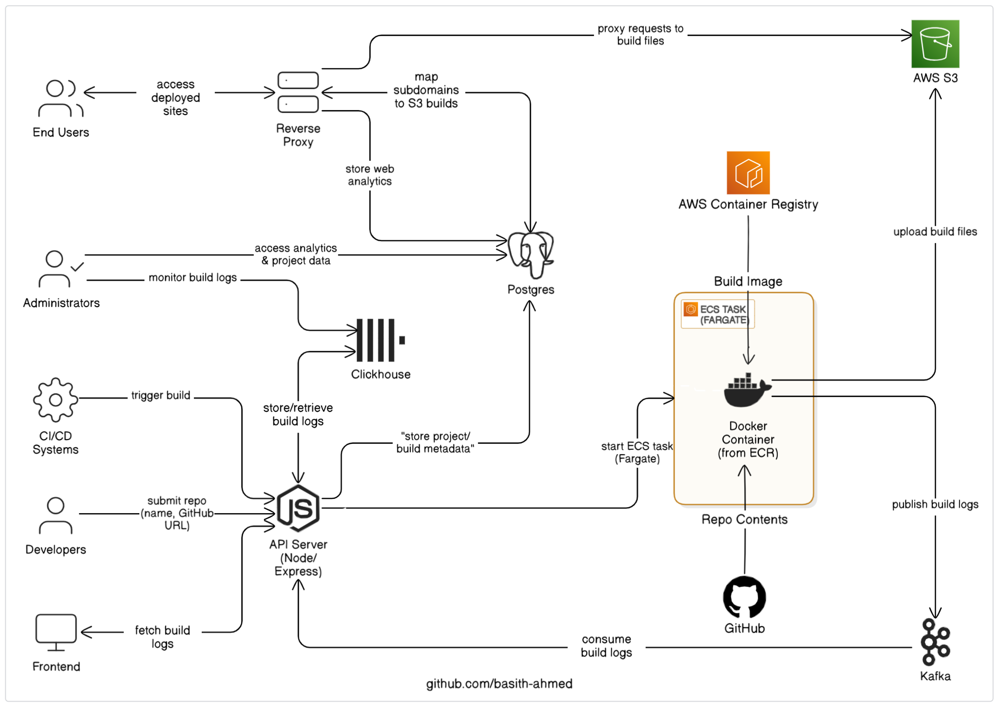

# Deploy-It: Cloud Deployment Platform

Deploy-It is a cloud deployment platform that automates the deployment process of web applications using AWS ECS, Fargate, S3, Kafka, ClickHouse, Postgres, Docker, Node.js, and Express.

## Overview

Deploy-It integrates infrastructure services and container-based workflows to streamline web app deployment, there are three main services in this project:

1. **Build Server for Deployment**: `/build-server`  
2. **Log Processing and Storage**: `/api-server`  
3. **Request Handler Proxy**: `/req-handler-proxy`

## 1. Build Server: `/build-server`

A containerized build executor launched on-demand via AWS ECS Fargate. This service is containerized and pushed to AWS Container Registry.

### Responsibilities:

- Clone GitHub repository
- Install project dependencies
- Run production build
- Upload artifacts to S3
- Stream structured logs to Kafka (topic: `build-log`)

## 2. API Server: `/api-server`

An Express.js-based control plane that manages users, projects, deployments, logs, and analytics.

### Core Functions:

- Project CRUD
- Trigger build deployments
- Consume and store logs from Kafka to ClickHouse
- Aggregate request analytics
- Manage user auth and session

### Infra/Service Integrations:

- **AWS ECS Fargate**: Runs `build-server` container via `RunTaskCommand`
- **Kafka**: Receives structured logs from build containers
- **ClickHouse**: Stores structured logs for fast queries
- **Prisma**: ORM for PostgreSQL (users, projects, deployments)

### API Routes:

#### `POST /project`

- Creates new project with a unique slug
- **Input Fields**: `name`, `gitRepoURL`

#### `POST /deploy`

- Accepts `projectId`
- Creates new deployment (`status = QUEUED`)
- Triggers ECS Fargate build with:
  - `GIT_REPO_URL`, `PROJECT_ID`, `DEPLOYMENT_ID`
  - Subnet and security group
  - Launches `build-server` container

#### `GET /logs/:id`

- Queries logs in ClickHouse by `deployment_id`

#### `GET /analytics/:projectId`

- Aggregates analytics grouped by:
  - Path, Method, User Agent, IP

#### `POST /register` & `POST /login`

- Registers and logs in users
- Uses bcrypt for password hashing
- Returns JWT on login

#### `GET /projects` (Auth Required)

- Lists all user-associated projects

#### `GET /deployments/:projectId` (Auth Required)

- Lists all deployments for a project

### Kafka Consumer:

- Subscribes to topic `build-log`
- JSON-parses each log
- Inserts into `log_events` table in ClickHouse

## 3. Request Handler Proxy: `/req-handler-proxy`

Reverse proxy for routing frontend requests to deployed project containers.

### Core Responsibilities:

- Subdomain or custom domain-based routing
- Reverse proxy to project containers
- Logs each request for analytics

### Behavior:

1. **Domain Parsing**  
   Extracts subdomain from `req.hostname`  
   Matches with `subdomain` or `customDomain` in project table

2. **Request Logging**  
   Asynchronously inserts:
   - `path`, `method`, `userAgent`, `ip`, `projectId`  
   Into `analytics` table.

3. **Proxy Handling**  
   Proxies request to the corresponding build files in S3.

## Components

| Layer        | Technology                          |
|--------------|-------------------------------------|
| **Frontend** | Next.js, TailwindCSS                |
| **Backend**  | Node.js, Express.js, Docker         |
| **Infra**    | AWS ECS, Fargate, S3, ECR           |
| **Messaging**| Kafka                               |
| **Logs**     | ClickHouse                          |
| **Database** | PostgreSQL (via Prisma ORM)         |